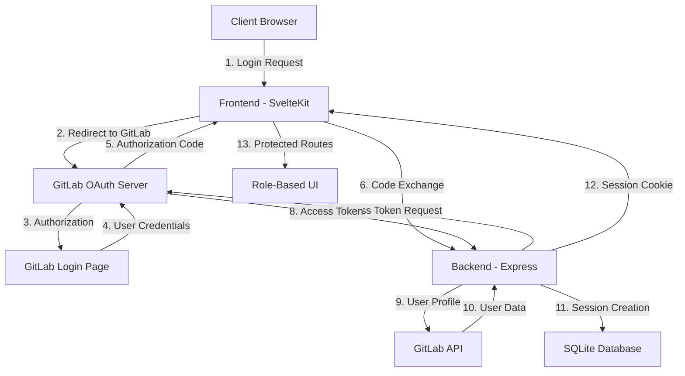
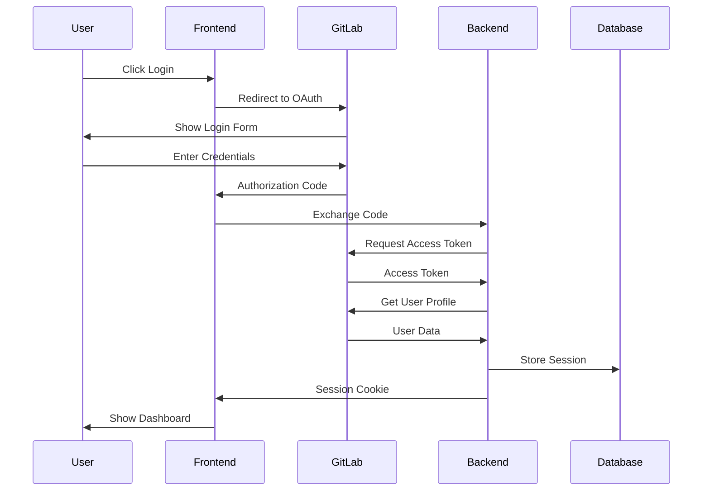
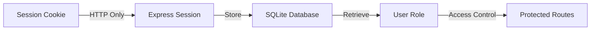

# GitLab Authentication Documentation

## Table of Contents
1. [Overview](#overview)
2. [Architecture](#architecture)
3. [Authentication Flow](#authentication-flow)
4. [Implementation Details](#implementation-details)
5. [Security Considerations](#security-considerations)
6. [Troubleshooting](#troubleshooting)

## Overview

The GitLab Role-Based Access Control (GCCM) system implements OAuth2 authentication with GitLab in a private network environment. This document provides detailed technical information about the authentication system implementation.

## Architecture



## Authentication Flow

### 1. Initial Login Request


### 2. Session Management


## Implementation Details

### 1. Frontend Implementation
```javascript
// src/lib/stores/auth.js
export const user = writable(null);
export const isAuthenticated = writable(false);
export const userRole = writable(null);

export async function checkAuth() {
  try {
    const response = await fetch('http://localhost:3001/auth/me', {
      credentials: 'include'
    });
    
    if (response.ok) {
      const userData = await response.json();
      user.set(userData);
      isAuthenticated.set(true);
      userRole.set(userData.role);
    }
  } catch (error) {
    console.error('Auth check failed:', error);
  }
}
```

### 2. Backend Implementation
```javascript
// server/src/index.js
passport.use('gitlab', new OAuth2Strategy({
  authorizationURL: 'http://80.1.0.250:100/oauth/authorize',
  tokenURL: 'http://80.1.0.250:100/oauth/token',
  clientID: process.env.GITLAB_CLIENT_ID,
  clientSecret: process.env.GITLAB_CLIENT_SECRET,
  callbackURL: "http://localhost:3001/auth/gitlab/callback"
}, async (accessToken, refreshToken, profile, done) => {
  try {
    const response = await fetch('http://80.1.0.250:100/api/v4/user', {
      headers: {
        'Authorization': `Bearer ${accessToken}`
      }
    });
    const userData = await response.json();
    return done(null, userData);
  } catch (error) {
    return done(error, null);
  }
}));
```

### 3. Database Schema
```sql
CREATE TABLE users (
  id INTEGER PRIMARY KEY AUTOINCREMENT,
  gitlab_id TEXT UNIQUE NOT NULL,
  username TEXT NOT NULL,
  email TEXT UNIQUE NOT NULL,
  role TEXT NOT NULL DEFAULT 'developer',
  created_at DATETIME DEFAULT CURRENT_TIMESTAMP,
  updated_at DATETIME DEFAULT CURRENT_TIMESTAMP
);

CREATE TABLE sessions (
  id INTEGER PRIMARY KEY AUTOINCREMENT,
  user_id INTEGER NOT NULL,
  token TEXT NOT NULL,
  expires_at DATETIME NOT NULL,
  created_at DATETIME DEFAULT CURRENT_TIMESTAMP,
  FOREIGN KEY (user_id) REFERENCES users(id)
);
```

## Security Considerations

### 1. Session Security
- HTTP-only cookies
- Secure flag in production
- Session expiration
- CSRF protection

### 2. OAuth2 Security
- State parameter validation
- Secure token storage
- Proper scope management
- Token expiration handling

### 3. Network Security
- Private network isolation
- HTTPS in production
- CORS configuration
- Rate limiting

## Troubleshooting

### Common Issues and Solutions

1. **Authentication Failures**
   - Check GitLab OAuth credentials
   - Verify network connectivity
   - Validate redirect URIs
   - Check session configuration

2. **Session Issues**
   - Verify cookie settings
   - Check database connectivity
   - Validate session middleware
   - Clear browser cache

3. **Role Assignment Problems**
   - Check database permissions
   - Verify role middleware
   - Validate user data
   - Check session storage

## Configuration Examples

### 1. Environment Variables
```env
GITLAB_CLIENT_ID=your_client_id
GITLAB_CLIENT_SECRET=your_client_secret
SESSION_SECRET=your_session_secret
PORT=3001
```

### 2. GitLab OAuth Application Settings
```
Name: GCCM
Redirect URI: http://localhost:3001/auth/gitlab/callback
Scopes: read_user, read_api
```

### 3. Session Configuration
```javascript
app.use(session({
  secret: process.env.SESSION_SECRET,
  resave: false,
  saveUninitialized: false,
  cookie: {
    secure: process.env.NODE_ENV === 'production',
    httpOnly: true,
    maxAge: 24 * 60 * 60 * 1000 // 24 hours
  }
}));
```

## Best Practices

1. **Development**
   - Use environment variables
   - Implement proper error handling
   - Follow security guidelines
   - Test thoroughly

2. **Production**
   - Enable HTTPS
   - Use secure cookies
   - Implement rate limiting
   - Monitor authentication logs

3. **Maintenance**
   - Regular security updates
   - Session cleanup
   - Token rotation
   - Access review 